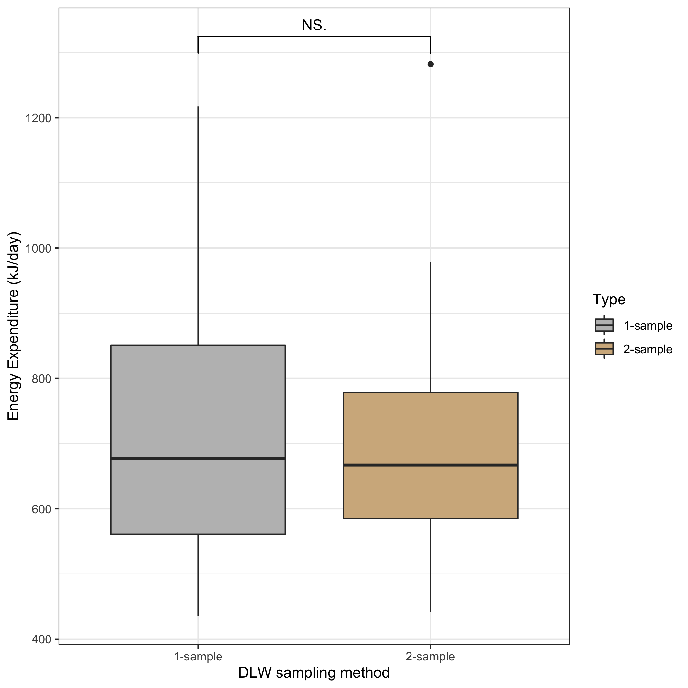
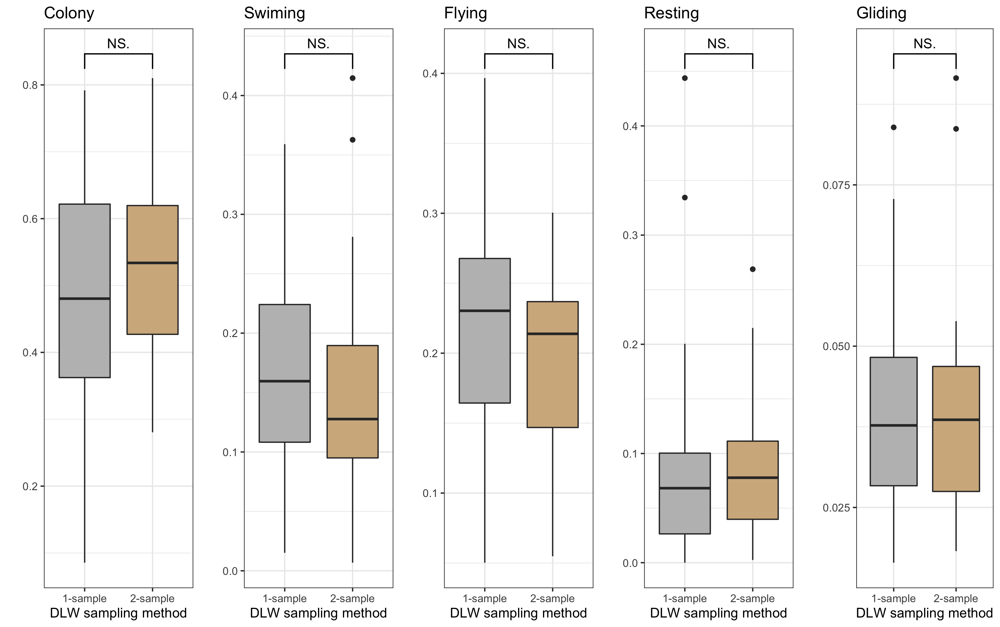

```{r setup, include=FALSE}
knitr::opts_chunk$set(echo = TRUE)
```

**TITLE:** Kittiwake Energetics Moc Project

Fred Tremblay^1\*^

^1^Department of Natural Resources, McGill University, Montreal, Canada

\*Corresponding author

\newpage

#Abstract

Here, we investigate the effects of the two-sample method compared to the single-sample method for measuring energy expenditure using DLW in free-ranging black-legged kittiwakes (Rissa tridactyla).

#Introduction 

Energy is a common currency for any living organism, and understanding how animals use energy is critical to understanding their ecology and consequently how they might adapt to changes in their environment. Individual variation in daily energy expenditure is often linked to varying activity budgets. Doubly-labelled water (DLW) is a commonly used technique to measure energy expenditure in wild animals (Speakman 1997). The use of DLW enables us to measure daily energy expenditure by injecting a bolus of heavy water (deuterium and 18 O). Commonly used when using DLW is the two sample method. Yet, when working with free-ranging animals, the manipulations linked with the two sample method can be invasive and stressful for the animals. Here, we investigate the effects of the two-sample method compared tot he single-sample method for measuring energy expenditure using DLW in free-ranging black-legged kittiwakes (Rissa tridactyla).

#Methods 

We measured energy expenditure in black-legged kittiwakes using doubly--labelled water using two commonly used method: the single-sample and the double-sample method. Along with our measure of energy expenditure, we calculated time-activity budgets of free ranging kittiwake susing GPS-accelerometry data. We completed all analysis and figures using Rstudio.

#Results 

Both DLW method are comparable and did not have a differential impact on the kittiwakes' energetics (figure 1) and time-activity budget (figure 2).

#Discussion

The two-sample method when measuring energy expenditure has no differential impact on the kittiwakes when compared tot he single sample method. Thus, as the two-sample method allows us to measure energy expenditure more precisely, this method should be favored.

#References

#Figure Captions

Figure 1: Energy expenditure (kJ/day) of single-sampled (grey) and two-sampled (beige) black-legged kittiwakes.

Figure 2: Time-activity budget of single-sampled (grey) and two-sampled (beige) black-legged kittiwakes.

#Figures





#References
